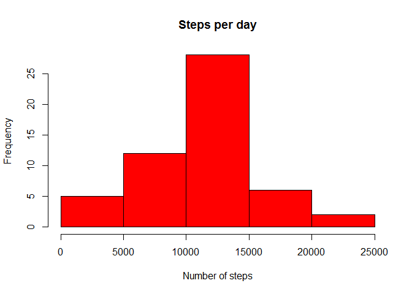
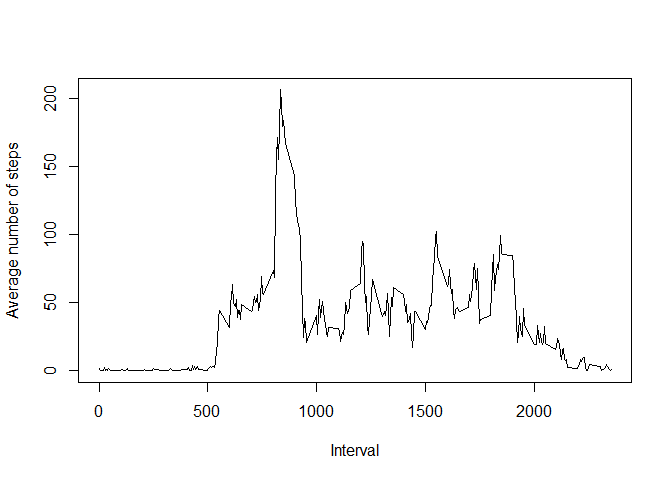
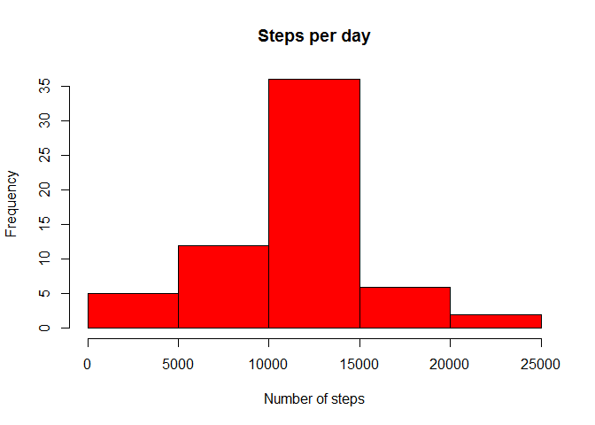
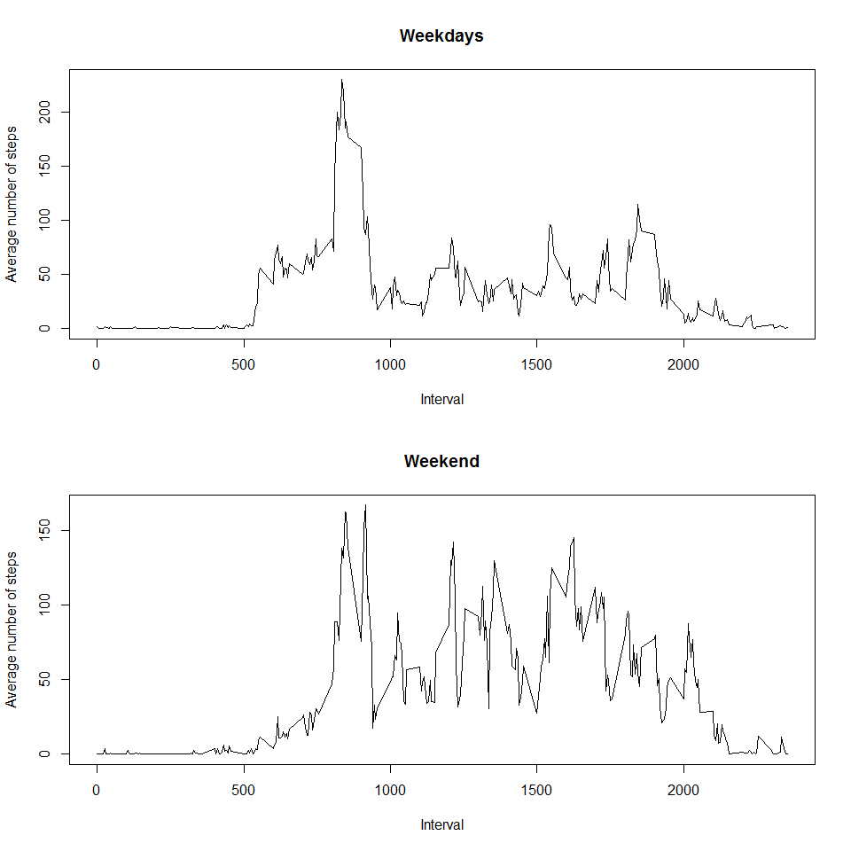

# Reproducible Research: Peer Assessment 1


## Loading and preprocessing the data

We load the data in and parse the date as a Date variable.


```r
data = read.csv("activity.csv")
data$date = as.Date(data$date, "%Y-%m-%d")
```


## What is mean total number of steps taken per day?

We ignore the NA values and make a histogram of the steps taken per day.


```r
dataWithoutNA = data[!is.na(data$steps), ]
stepsPerDay = split(dataWithoutNA$steps, dataWithoutNA$date)
stepsPerDay = sapply(stepsPerDay, sum)
hist(stepsPerDay, col = "red", main=("Steps per day"), xlab = "Number of steps")
```

 

Calculating the mean and median of the total number of steps taken per day.


```r
print(paste0("Mean is : ", mean(stepsPerDay)));
```

```
## [1] "Mean is : 10766.1886792453"
```

```r
print(paste0("Median is : ", median(stepsPerDay)));
```

```
## [1] "Median is : 10765"
```

## What is the average daily activity pattern?

Here we plot the average number of steps taken per interval, averaged across all days.


```r
stepsPerInterval = split(dataWithoutNA$steps, dataWithoutNA$interval)
stepsPerInterval = sapply(stepsPerInterval, mean)
plot(x = names(stepsPerInterval), y = stepsPerInterval, type = "l", xlab = "Interval", ylab = "Average number of steps")
```

 

```r
print(paste0("Interval maximum number of steps is: ", names(stepsPerInterval[which(stepsPerInterval == max(stepsPerInterval))])))
```

```
## [1] "Interval maximum number of steps is: 835"
```

## Imputing missing values

Calculating the number of NA's.


```r
sum(is.na(data$steps))
```

```
## [1] 2304
```

We are going to replace the NA's with the average of the interval across all days. After that we plot a histogram of the steps taken per day.


```r
dataNA = data[is.na(data$steps),]

dataNA[, "steps"] = stepsPerInterval[as.character(dataNA[, "interval"])]

dataFilledIn = rbind(dataNA, dataWithoutNA)

stepsPerDayFilledIn = split(dataFilledIn$steps, dataFilledIn$date)
stepsPerDayFilledIn = sapply(stepsPerDayFilledIn, sum)

hist(stepsPerDayFilledIn, col = "red", main=("Steps per day"), xlab = "Number of steps")
```

 

Calculating the mean and median of the total number of steps taken per day again.


```r
print(paste0("Mean is : ", mean(stepsPerDayFilledIn)));
```

```
## [1] "Mean is : 10766.1886792453"
```

```r
print(paste0("Median is : ", median(stepsPerDayFilledIn)));
```

```
## [1] "Median is : 10766.1886792453"
```

As you can see the mean is the same and the median changed slightly.
The total number of days also increased as you can see in the frequency numbers.

## Are there differences in activity patterns between weekdays and weekends?


```r
weekend = c("zaterdag", "zondag")
dataFilledIn$partOfWeek = factor(weekdays(dataFilledIn$date) %in% weekend, labels = c("weekday", "weekend"))

par(mfrow=c(2,1))

dataSplit = split(dataFilledIn, dataFilledIn$partOfWeek)
dataSplitPerInterval = sapply(dataSplit, function(x) {
    sapply(split(x$steps, x$interval), mean)
})

plot(x = names(dataSplitPerInterval[,1]), y = dataSplitPerInterval[,1], type = "l", main = "Weekdays", xlab = "Interval", ylab = "Average number of steps")

plot(x = names(dataSplitPerInterval[,2]), y = dataSplitPerInterval[,2], type = "l", main = "Weekend", xlab = "Interval", ylab = "Average number of steps")
```

 

As you can see in the weekdays, the subject gets up earlier, but in the weekends there is more activity during the day.
